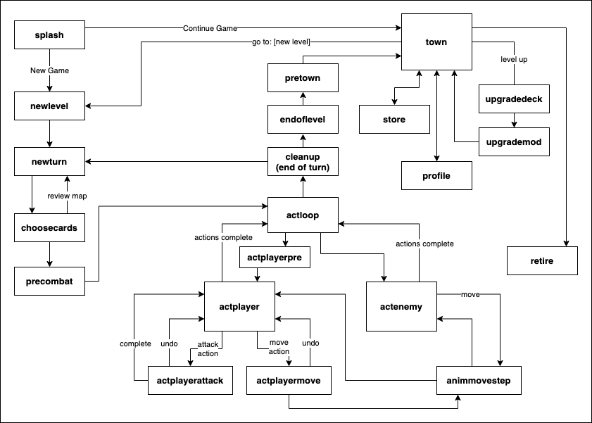

Developer notes-to-self to accompany PICOhaven source code, to make it easier to remember the big picture if I take a break and come back to it. And perhaps they'll be useful to others. I don't claim to be a software engineering expert, this is not my day job :), but I iterated a number of times to get here.

*These have not been fully cleaned up so may include some obsolete notes / global variables no longer used...*

# Running Game
This file is focused on development notes not play notes. See [README.md](README.md) for a game overview and where and how to play it.

# Development Workflow / Build + Run notes

The game source is primarily split between two files:
- `picohaven###.lua` -- main game code, about 1700 lines of PICO-8 flavored Lua, plus comments
- `picohaven###.p8` -- the game 'cart' which has sprites, map, sfx (plus some game strings stored in unused gfx/sfx space via helper cart storedatatocart...), and which #includes that .lua file of code

My typical development + test loop (v1):
- Edit the source code in `picohaven100e.lua` using VScode or another external editor-- it is too large for the PICO-8 built-in editor to open because of its in-code comments, which I didn't want to remove
- Whenever I want to run it, because the base code is far over the compressed size limit, strip comments and whitespace with a command like this (suggested on [the PICO-8 forums](https://www.lexaloffle.com/bbs/?pid=72975#p)):
  -  `./minify_reg.sh picohaven100e.lua minify_rules2.sed > picohaven100e_minify.lua`
  -  I try to not do other minification to keep the file readable-- comment and whitespace stripping is currently just _barely_ enough
- In the PICO-8 application, load and run `picohaven100.p8` (which as of this writing just includes the source from `picohaven100e_minify.lua`, plus contains the sprites, sfx, map, and so on). If it's already open you can just hit Ctrl-R to reload changes (after running the minify_reg command above), which gives a nice quick testing loop
  - Edit this .p8 file when needed to edit graphics, maps, sound, music.
- Core game data (player cards, upgrades, items, monster decks and stats) is stored in strings in the .lua source, but I have a helped spreadsheet that lets me adjust all the numbers and abilities, then concatenate them into a string I copy and paste into the .lua source
- Story text (shown before/after each level) wouldn't fit within the cart limits, originally... so it's now stored in a binary format in unused space in the cart's sprite and sound data, using separate program `storedatatocart4r.p8`. I edit the story text in a spreadsheet which concatenates it into a specific format for storedatatocart.p8, then run that to overwrite those parts of the picohaven###.p8 cart
- Note: INFO at the PICO-8 commandline after a change will show token/character usage including the #included Lua

Revised v1.1 workflow:
- As above, but using minifier Shrinko-8 instead of my shell/.sed script, e.g. `shrinko8.py picohaven_v11a.lua picohaven_v11a_sminify.lua --minify --preserve "*.*"` (that minified code is no longer readable, unfortunately)
- The most current versions of the source are picohaven_v11a.lua and picohaven_v11.p8

# Source code organization & overview

The source code itself has a table of contents for code organization ,and moderately detailed in-code comments. 

In addition, some notes I refer back to during development:

## Color palette

The game uses a reduced palette of 8 colors (with exceptions for the player and final boss):
- 0 (black) -- general use
- 1 (dark blue) -- environment (water)
- 5 (dark grey) -- general use
- 6 (light grey) -- text, obstacles, general use
- 7 (white) -- emphasized text
- 8 (red) -- health, wound, attacks, warnings, elite enemy eyes, sprite highlights
- 12 (cyan) -- selection cursor, selected items, button-press prompts, sparing use as sprite highlights
- 13 (purplish grey) -- treasure, general use

## Sprite Flag Meanings

- 0: actor initialization during initlevel
- 1: impassible (to move and LOS)
- 2: impassible move (unless jump), allows LOS
- 3: animated scenery (default: 4 frames)
- 4: triggers immediate action (trap, door)
- 5: triggers EOT action (treasure)
- 6: edge of room (unfog up to this border)
- 7: is doorway (trigger door open at EOT)

## Gameflow State Machine

Generally, the game uses a state machine to partition different gameplay (i.e. different update and draw behavior) into different functions, rather than one update function with many if statements or global variables that set behaviors. changestate() changes to a new state, calling its init function, which typically sets the new update and draw functions if needed.

However, there's some overhead in coding a new state, especially if its behavior is very similar to other states or only used in one place, so some changing gameplay within states is controlled by global variables (see below for the many global variables that indicate for example the phase of a boss fight, whether the message box is in 'interactive scrolling mode', and so on).

Not included in above: 'scroll message box' temporary state.

## Global Variables Summary

Global variables and data structures are used liberally to avoid burdening every function call with extensive lists of parameters, given the strict code size limitations. To mitigate the risks of this, all other variables should be explicitly declared as local, and I keep a summary of global variables here to refer back to.

**debugging** (currently removed to save tokens):
- `debugmode` (bool)
- `logmsgq` (bool)

**flow control and state related**:
- `state, prevstate, nextstate` -- prevstate/nextstate used by a few functions that run and then proceed to next state or return to previous state
- `_updstate, _drwstate` -- current update/draw routines, different depending on state
- `_updprev` -- previous _updstate function: used to store an _updstate to return to after execution a specialized _upd function it's not worth changing state for (for example for msgq review)
- `initfn[]` -- array of init functions to run when changing to [state]
- `msgq` -- queue of strings to display in msgbox (max length ~22 chars/line depending on char)

**gameplay / level related**:
- `dlvl` -- dungeon level
- `doorsleft` -- doors left to open in level, part of check for end of level
- `fog[]` -- 11x11 array with either '1' (fog of war) or 'false' (unfogged)
- `gppercoin` -- scales with difficulty
- `trapdmg`
- `mapmsg` -- message to show in map area (at beginning and end of level)
- `pretxt[], fintxt[]` -- pre- and post-level text to display (stored in unused sprite/sfx memory by a separate cart compresstxt.p8 and retrieved during runtime using decode4r(), to save ~7k characters)
- `tutorialmode` -- determines whether to display additional messages and tips
- `difficulty`
- `difficparams[]` -- sets HP and gold scaling per level, etc (and description)

**Special wincons, event triggers**:
- `lootedchests` -- # of chests looted in level (sometimes an alt wincon or trigger)
- `bossphase2` -- trigger special phase 2 of boss fight
- `wongame` -- trigger "reture" option in town

**animation-related**:
(the .ox/.sox approach to animation is based on the system seen in the Lazy Dev Academy Roguelike youtube videos)
- `animt` -- animation timer: set to 0 to initiate animation-only updates that increment animt, until animt=1 
- `.sox, .soy` -- the starting location (in pixels) of an object we're animating the motion of
- `.ox, .oy` -- the current during-animation display offset (in pixels) of an object we're animating the motion of. when animt=1, .ox,.oy should have decreased to zero, as the object should be displayed at its final location.
- `fram` -- increments every cycle through program
- `afram` -- animation frame, cycles from 0->3 repeatedly
- `animtd` -- increments  of animt from 0-1  during animation (lower increment = slower animations)
- `shake` -- how many pixels to shake the map area by each frame, used for specialized animations (0 = no shaking)
- `screenwipe` -- ranges from 0 (no wipe) to 63 (initiative wipe)
- `msg_td` -- scroll msg every # frames
- `act_td` -- update actor anims every # frames

**UI selection related**:
- `selx, sely, seln` -- x, y, and n positions of selection cursor within a list (seln = position in a 2D list)
- `selvalid` -- true = current selection is valid (mostly used to check valid move and attack targets for player)
- `showmapsel` -- true = show yellow selection cursor on map (typically paired with the update() function calling selxy_udpate_clamped() to update selx, sely)

**cards and deck-related**
- `pdeck` -- player deck of cards (each element a crd data stricture)
- `tpdeck` -- pdeck with virtual "rest" card appended, for choosecards()
- `longrestcrd` -- pointer to long rest card in master deck
- `crdplayed` -- globally saved link to card currently being played by player, so that we can provide an option to undo an action and restore card/deck state before it's completed
- `crdplayedpos` -- where in card list this was, to allow smooth insertion back into list in case of undo

**Card data structures**. Enemy cards may only have [0] and [1] fields:
- `card[0]` = initiative
- `card[1]` = card 'code' that describes action (e.g. `█2➡️3∧` = "attack 2 at range 3 and wound")
  - `descact[]` is a lookup table that maps █ to attack, for example
- `card[2]` = status (0 = in hand, 1 = discarded, 2 = burned)
- `card[3]` = title (e.g. "hurl sword")

If I did it again, I'd likely make those each properties (e.g. `card.status` instead of `card[2]`), to make the code more readable when coming back to it after a break, and incidentally saving a few tokens (in PICO-8's token-counting system, a.property uses 2 tokens while a\[property\] uses 3-- a small difference but it adds up).

**Crd "parsed individual card actions" structure**. For example, from the sample `█2➡️3∧` card above:
- `crd.act, crd.val` -- action and value, e.g. `█,2` for "attack 2" 
- `crd.mod, crd.modval` -- 2nd param and value, e.g. `➡️,3` for "range 3"
- `crd.rng` -- attack range (if any), 1 for melee
- `crd.stun, crd.wound` -- if card inflicts that condition
- `crd.burn` -- if burned after use (player only)
- `crd.aoe` -- to indicate one of various Area-of-Effect patterns is applied to the attack (only one simple pattern is implemented)
- `crd.special` -- for special player or enemy actions that don't fit the above and have custom code for handling them, e.g. "call" (summon), "rest", "howl" etc

**`actor[]` data structures**:
the below are all properties of form `actor[n].foo` e.g. `actor[n].crds`, often used with alias `a=actor[n]` to be `a.hp`, etc.
Note that `actor[1]` is initialized to = `p` (the player data structure, with similar fields)
- `spr` -- first sprite frame (and the following 3 for animation)
- `bigspr` -- player only: index of 16x16 profile sprite
- `lvl` -- player level
- `x, y` -- locations (in map tiles, 0-10)
- `hp, maxhp, xp, gold` -- (no xp, gold for enemies)
- `shld` -- shield value (0 if no shield)
- `pshld` -- persistent shield (restored each round)
- `stun, wound` -- true/false (or often, true/nil) statuses
- `crds` -- list of cards (card data structure above) to play or choose from this turn. for enemies, 1-2 entries. for player, can be 1, 2, or 4.
- `crd` -- card currently being acted on (in the "crd parsed individual card actions structure" noted above)
- `init` -- current turn initiative
- `crdi` -- index of card within a.crds[] to play next. only used for enemies, to keep track of position in a list of cards to play.
- `type` -- for enemies, links back to a row in the `enemytypes[]` data structure which includes the deck,e tc
- `actionsleft` -- for player, list of actions they can still take this turn (starts at 2, decrements)
- `noanim` -- property of actors[] that don't have frames to animate through
- `ephem` -- property of actors[] which are ephemeral visual indicators that should only exist for an animation cycle and then be deleted (attack / damage animations)

**enemytype[] data structure**:
- `enemytype.crds, .crd, .init` -- redundant with above? tbd
- `.hpdrawn` -- a temporary value used during drawheadsup() to track whether an instance of this enemytype has been drawn with its details (due to being selected on map), to avoid drawing other instances of the same enemytype over it

**Town and upgrades related** (misc):
- `townmsg` -- message to show in town
- `townlst[]` -- list of in-town menu options (dynamically generated)
- `upgradelists` -- global used by two different upgrade routines (deck and mod) to pass list of lists to draw function (to share same draw function)
- `pmodupgradesmaster` -- mod upgrades available, combining the starting set (the first `pmodupgradessize`) and 1 more per levelup
- `pdeckmaster[]` -- all potential player deck cards (of the `card[]` data structure above), combining the starting pdeck (the first `pdecksize` entries) and future upgrade options (2 upgrade cards per level)

**Turn sequencing** (tracking active actor, action, etc):
- `ilist[], initi` -- list of `{initiative, actor#}` pairs for all actors this turn, sorted in initiative order. `initi` is the index of the row within this list currently acting
- `actorn` -- index for actor[] of the active actor (during turn execution, read from sorted-by-initiative list of actors in ilist)
- See also actor.crds, .crdi, .init, and similar above in the actor data structure notes

**Other** (to organize):
- `mvq` -- list (queue) of adjacent squares the current actor is moving through, starting at current position, in format `{{x=x0,y=y0},{x=x1,y=y1},...}`. Used to move and animate an actor through a path, checking for triggers (traps, doors, etc) at each step
- `dirx[], diry[]` -- save tokens for common x/y +-1 offsets
- `restburnmsg` -- message describing which card was burned for a "long rest" (chosen during choosecards() but not displayed until player action)
- `godmode` -- sets player hp/attacks/move/range to large #s behind the scenes (inflated atk/mv/rng not shown in cards). *disabled to save tokens*
- `avatars, avatar` -- selection of name, small sprite, and large sprite (for profile) for player to provide a few options: DEPRECATED to save tokens

**Major game content DBs loaded from strings** (some also listed in sections above):
- `lvls[]` -- all non-map data for each level. generated by writing out level info an external spreadsheet which compiles them into one long string to be split.
- `pretxt[], fintxt[]` -- pre- and post-level text to display (stored in unused sprite/sfx memory by a separate cart compresstxt.p8 and retrieved during runtime using decode4r(), to save ~7k characters)
- `enemytype[]` -- 
- `enemydecks[]` -- list of cards per enemy, indexed using `enemytype.name` or `actor.name` as key
- `pdeckmaster[]` -- all potential player deck cards (of the `card[]` data structure above), combining the starting pdeck (the first `pdecksize` entries) and future upgrade options (2 upgrade cards per level)
- `pmoddeck` -- initial modifier deck
- `pmodupgradesmaster` -- mod upgrades available, combining the starting set (the first `pmodupgradessize`) and 1 more per levelup
- `rndtreasures` -- selections for each chest, ranging from [g]old to [d]amage to [x]p
- `storemaster[], store[], pitems[]` -- similarly: master list of all items in game, items currently in store, and items owned by player
- `slvrstl` -- pointer to special item in storemaster[] (not available in store)-- silversteel blade found in one level

**Persistent data (save/load)**:
- `dgetseti` -- auto-incrementing index allowing dget()/dset() to not specify index on each call

**UI layout related** (many of them constants, to avoid hard-coding a lot of numbers and make tweaks simpler):
- `msg_x0` -- x offset added to message box (0 for normal location)
- `msg_w` -- width of message box
- `msg_yd` -- pixel-level scrolling offset of msgbox
- `map_w` -- width of map including border (also typically of message box)
- `hud_x0` -- x0 of HUD column
- `hud_py` -- actor box on HUD: y pos
- `hud_ey` -- enemy HUD y pos and spacing (at 0, hud_ey, hud_ey*2, etc) 
- `ehudn[]` -- formerly a global, turned into local in drawheadsup() and recalculated every cycle
- `gc_fg, gc_bg, gc_bg2, gc_sel` -- (DEPRECATED, hard-coded once selected, to save tokens) four global colors used (especially gc_bg = background color for e.g. profile and card selection screens, and gc_sel = selection box color)
- `minispr` -- maps special characters to sprites to display instead (in printmspr()), e.g. Shift-A special character = "attack" option, also see `sh()` and the Sprite "font" notes below:

## Sprite "font"
Various characters outside the standard alphanumeric \[a-z0-9\] encode specific sprites to be mixed in with text, see `minispr[]` and `printmspr()`. 

NOTE: As of v1.1 (Aug 2022), this approach has been replaced by a PICO-8 custom font poked into memory and some of this section is obsolete when it comes to the details. The printmspr() function has been updated (see it for details), but I will update this documentation at some point...

The most common of these are Shift+letter (i.e. replacement for the extended double-width characters, CHR(128) to CHR(153)):
- [i]tem, [p]ush, [a]ttack, [m]ove, [h]eart, [g]old, [j]ump, 
- [r]ange, [s]hield, [w]ound, [b]urn, [z]stun, [l]oot

With sprites shown below:

For example, "웃" is what PICO-8 displays if you press shift-j, this is CHR(127) and is used to symbolize "jump" or to print the "jump sprite", whose number is stored in minispr["웃"]

In addition, some letters written in 'puny font' (appear as CAPS in text editor, CHR(65) to CHR(90)) have special meanings:
- [A]..[H] for AoE sprites #21-28 (only H used to date, for AoE pattern #8, '8 adjacent cells include diagonals'...)
- [I]..[M] for item sprites (created but not currently used: [N]..[O] for 'used item' sprites)
- [U],[D], [X] for simplified arrows (7x5) and ❎ (7x7)

## enemy and player cards-to-play data structures
- p.crds (array of 4 playable full cards, init and all)
- p.crd: parsed data struct (.act,.val,.stun, etc) for card currently being played
- p.init
- a.crds or a.type.crds: list of enemy cards (redundant)
- a.crd: data struct for card currently being played
- a.init or a.type.init (redundant)

# Miscellaneous Other Notes

## Token / resource usage

During development I regularly ran into resource limits (tokens, characters, compressed size) and had to restructure code or data. Keeping some notes here about resource usage (more in notebook)

### token inventory of v1.0e release, 2021-Oct

Total resource usage vs. PICO-8 platform limits: 
- `8163 / 8192 tokens`
- `41356 / 65535 characters` (after stripping comments and whitespace)
- `15159 / 15616 (97%) compressed bytes` (also after stripping comments and whitespace)

Token and compressed size usage (only including the major contributors to this one), sorted by code organization section:
| tokens used  (/8192) | compressed  chars  (/15616) | code section |
| --- | --- | --- |
| 1159 | 2066 | 6) main UI draw loops and card draw functions |
| 1073 | 2041 | 4b) player action loop (some of this is also in enemy action loop) |
|  865 | 1496 | 9) miscellaneous helper functions |
|  790 | 1674 | 4a) enemy action loop (includes some common functions used in 4b) |
|  628 | 3538 | 11) inits and databases (substantial strings of data) |
|  580 | 159 | 3) pre-combat states (new turn, choose cards, etc) |
|  517 | 1368 | 5) post-combat states (cleanup, etc) |
|  377 | | 7) custom sprite-based font and print functions |
|  359 | | 14) levelup, upgrades |
|  355 | 1283 | 15) town and retirement |
|  275 | | 18) load/save |
|  271 | | 17) pathfinding (A*) |
|  211 | 646 | 1) core game init/update/draw |
|  200 | | 8) menu-draw and related functions |
|  129 | | 10) data string -> datastructure parsing + loading |
|  117 | | 12) profile / character sheet |
|  102 | | 4) action/combat loop |
|  99 | | 13) splash screen / intro |
|  56 | | 2) main game state machine |
|  0  | | x) pause menu items (deprecated) |
|  0 | | 16) debugging + testing functions |

### revised v1.1 release, 2022-Sep

Under the hood rewrite to use the PICO8 custom font functionality (saved ~150 tokens at the cost of many more characters and larger compressed size), some further code cleanup, minor new features (added tokens), and use of the Shrinko-8 minifier (saved significant characters and compressed size)

Total resource usage vs. PICO-8 platform limits: 
- `8031 / 8192 tokens` (even after adding in more tutorial notes and enhancements)
- `31840 / 65535 characters` (after aggressive minification)
- `13600 / 15616 (87%) compressed bytes`
 
### Future resource-shaving ideas

-  ~~Use PICO-8 custom font (available from 0.2.2 on) to include the attack/move/etc icons and save tokens relative to my minispr/printmspr functions... but at cost of more characters and compressed size~~
-  Fog-related code
-  If I develop future chapters, pare down messages / remove tutorial hints (suggest playing chapter 1 first to learn)
-  Encode/hard-code more level data in the DB rather than extracting it from the level at runtime (e.g. player starting location, door locations and # of doors, hard-code coordinates of an area to unfog for each door)? But makes adjusting level maps more annoying. Saves tokens at small cost in characters.
-  More aggressive minification (add code annotations to table keys to preserve, then use shrinko-8 more aggressively) (only saves chars/compressed size, not tokens)
-  Rework the split-string-to-kv-pairs function to only store the key names once if they're the same for every row (only saves chars/compressed size, not tokens)

## Dev Log / History

| version | date | estimated hours (not tracked) | notes |
| --- | --- | --- | --- |
| v0 | July 2021 | 4 | brainstorming, mockups on graph paper and later in image editor to see what kind of UI's even possible within 128 pixels (no code) |
| v0.1 | Aug 2021 | 15? | first playable prototype of concept (limited animations or text, no regard for duplicated code or efficiency), get first feedback |
| v0.2 | Sep | 80? | main work: add story, enemies, animations, music, special actions, items, save/load, iterate on game, refactor code to reduce size, it seems "mostly done except for some polish" (ha!) |
| v0.9 | Oct 12 | 60? | self-playtesting and iteration on details, more debugging, story, upgrades/balance, enemies. in-cart data storage and refactors to reduce size below limits. perhaps feature-and-content complete? release to a few folks for feedback |
| v1.0 | Oct 20 | 10 | updates based on feedback, improve enemy pathfinding, other improvements and debugging, first public release on BBS! |
| v1.0b | Oct 24 | 3 | more feedback-based revisions: more info messages, improve hand selection UI |
| v1.0d | Oct 28 | 6 | even more tutorial-related messages, "undo" option for move/attacks before confirmed, screen shake on "*2" mod |
| v1.0e | Nov 3 | 10 | almost no functional changes: add more detailed code comments, documentation, organization, read through all code and clean up. more time than expected! |
| v1.1 | Aug 31, 2022 | 15 | under the hood changes to free up some tokens (P8 custom font), plus more tutorial-related messages and minor enhancements and bugfixes. Partly setting groundwork to work on a "Chapter 2" some day |

**Estimated time spent on this project**

I'd guess somewhere between 150-250 hours (including learning, reading, poking around with music and graphics, and actually playing it over and over), but it's hard to know. This was mostly developed in the background over the course of three months, plus some additional time on documentation and writeup. Some weeks this was the equivalent of 2-3 evenings/week, but there were weeks I didn't touch it at all.
